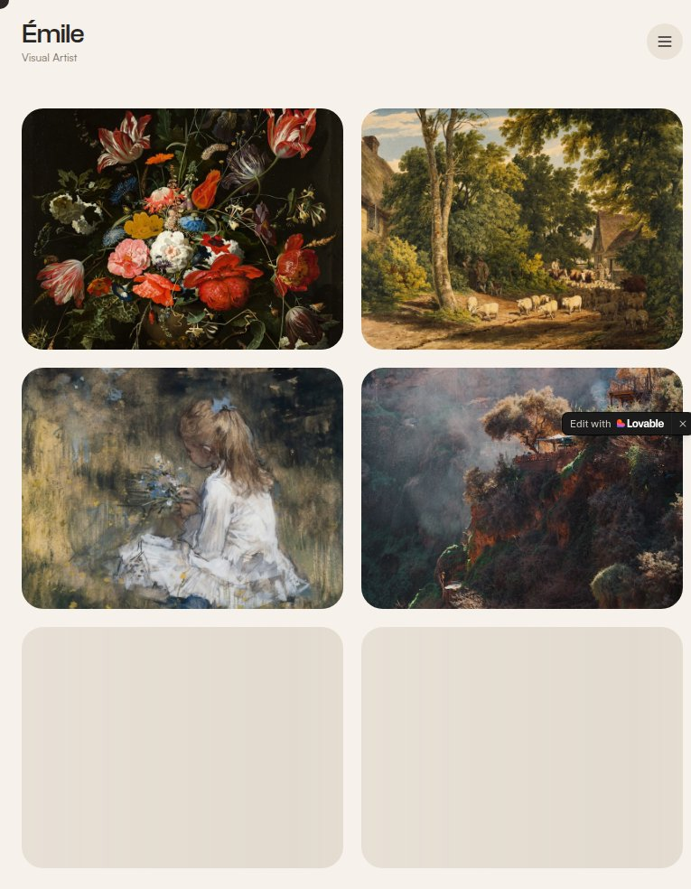

# Artist Gallery Portfolio — Website Template

## Overview
A gallery‑style portfolio template for artists and photographers. The preview highlights a grid of artwork thumbnails with soft UI chrome, emphasizing visual storytelling and minimal UI interference.

## Layout
- **Header + template title** with preview/create tabs.
- **Hero preview frame** showing an artwork grid with floating controls.
- **Key Highlights** list.
- **Features & Capabilities** accordion list.
- **Long narrative** about use cases and setup steps.
- **Related templates + footer**.

## UX patterns
- Art-first presentation: imagery dominates the preview.
- Minimal UI chrome keeps attention on portfolio pieces.
- Use cases reinforce monetizable portfolio outcomes.

## Animations
- Hover states on artwork cards and nav controls.
- Accordion transitions for feature details.

## Visual style
- Gallery‑white background with soft beige accents.
- Rounded cards and subtle shadows for a tactile feel.
- Calm, modern typography.

## Components
- Nav header + CTA
- Preview frame with gallery grid
- Highlights list
- Accordion features
- Long‑form sections
- Related template cards

## Framework/stack (inferred)
- **Next.js + React**
- **Tailwind CSS**
- **shadcn/ui**

## Prompt cues to recreate
- “Design a gallery‑style portfolio page with a framed hero preview showing a masonry/grid of artworks.”
- “Use soft neutrals, rounded cards, and minimal UI chrome.”
- “Include highlight list, accordion features, and onboarding steps.”
