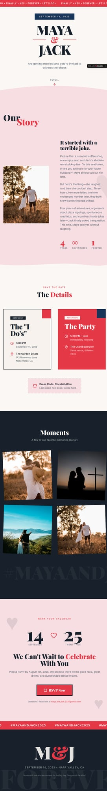

# Bold Love Wedding — Website Template

## Overview
A poster‑inspired wedding template with bold typography, graphic shapes, and high‑contrast colors. It’s designed for couples or agencies who want a distinctive, statement‑making wedding site.

## Layout
- **Header + CTA** and “Preview / Create” tabs.
- **Hero preview frame** with bold typographic centerpiece and graphic waves.
- **Key Highlights** list emphasizing fast launch and brand flexibility.
- **Features & Capabilities** accordion list.
- **Deep narrative** sections for use cases and setup steps.
- **Related templates + footer**.

## UX patterns
- Strong visual identity communicates uniqueness quickly.
- Preview frame used as primary persuasion asset.
- Accordion supports dense feature list without visual clutter.

## Animations
- Subtle hover states, tab switching.
- Potential parallax or graphic motion hinted by “bold/graphic” styling, but likely minimal.

## Visual style
- Bold serif/sans pairing with big, centered names.
- Bright accent blocks and graphic divider shapes.
- High contrast with clean whitespace.

## Components
- Nav header + CTA buttons
- Preview frame (image/iframe)
- Highlights card list
- Accordion features
- Long‑form sections
- Related template cards

## Framework/stack (inferred)
- **Next.js + React**
- **Tailwind CSS**
- **shadcn/ui**

## Prompt cues to recreate
- “Design a bold, poster‑inspired wedding template page with oversized type and graphic color blocks.”
- “Use a framed hero preview with wave/shape accents and strong contrast.”
- “Include highlights, accordion features, and long setup narrative.”
