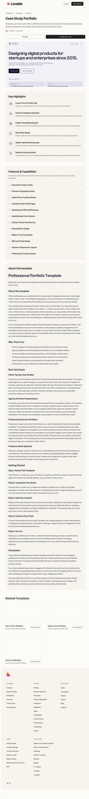

# Case Study Portfolio — Preview UI Analysis

## Overview
A modern product-designer case study portfolio for “Sarah Mitchell”. The homepage combines a strong positioning statement, clear contact CTAs, a stacked list of large case-study cards, and credibility sections for speaking/writing.

## Page structure
- **Header**
  - Left: avatar + name + location
  - Right: navigation links (**Work**, **Contact**) and a **theme toggle**
- **Hero**
  - Large headline: “Designing digital products…”
  - Short supporting bio line (role + current position)
  - Primary CTAs: **Email me** and **Let’s connect** (LinkedIn)
- **Services / entry points**
  - Small section: “How can I help you?”
  - Two cards:
    - **Design Request** (“Let’s talk about your project needs.”)
    - **Consulting** (“Sharing 10+ years of expertise.”)
  - Both route to email links
- **Selected work**
  - Vertical list of **large image cards** with:
    - index counter (e.g., **01/06**)
    - client + date range
    - case study title
  - Each card links to `/project/...`
- **Speaking**
  - List of talks/podcast/panel/workshop items with label + title + venue
- **Writing**
  - List of articles with title + publication
- **Closing CTA band**
  - Friendly outro + **Email me** + **Download resume**
- **Footer**
  - Email + social icons/links (LinkedIn/Twitter/Instagram)
- **Lovable badge**
  - Floating “Edit with Lovable” badge

## UX patterns
- **Clear conversion paths** (email + LinkedIn repeated).
- **Case study index** supports sequential browsing and communicates depth.
- **Credibility add-ons** (speaking, writing) reinforce seniority.
- **Theme toggle** suggests light/dark support.

## Visual design
- Light, neutral background with subtle lavender/gray tint.
- Card-based layout with generous spacing.
- Big, friendly typography; projects are image-forward.

## Components inventory
- Header with avatar + nav + theme toggle
- Hero headline + CTAs
- Service cards (mailto links)
- Case study list cards with counters and meta
- Speaking list
- Writing list
- Outro CTA band + resume button
- Footer with social links
- Lovable badge

## Notes for recreation
- Keep the **top-of-page CTA cluster** (Email + LinkedIn).
- Use **large stacked case-study cards** with an **index counter (01/06)** and metadata.
- Add **speaking/writing** sections to signal experience.
