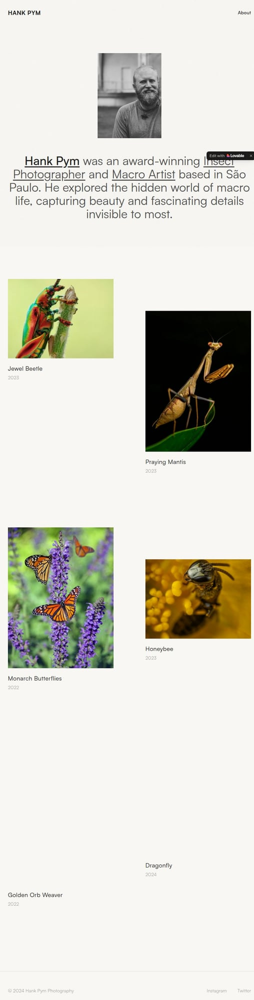

# Cinematic Photography Portfolio — Preview UI Analysis

## Overview
A minimalist photographer portfolio with a light, gallery-like background, a simple top nav, a centered portrait + bio intro, and an asymmetric two-column image grid where captions sit beneath each photo.

## Page structure
- **Top navigation**
  - Left: site title/brand “HANK PYM”
  - Right: **About** link
- **Intro / bio block**
  - Centered portrait image
  - Large paragraph bio with emphasized/underlined linked keywords (e.g., “Insect Photographer”, “Macro Artist”)
- **Work gallery**
  - Asymmetric two-column grid of large photos
  - Each item presented as an **article/card** with:
    - Image
    - Title (e.g., “Jewel Beetle”)
    - Year (e.g., 2023)
  - Varied image sizes create a cinematic/editorial rhythm
- **Footer**
  - Copyright text
  - Social links (Instagram, Twitter)
- **Lovable badge**
  - Floating “Edit with Lovable” badge + dismiss control

## UX patterns
- **Single-scroll landing**: bio → gallery → footer.
- **Gallery-first browsing**: each image tile reads like an entry point to a detail page.
- **Editorial emphasis** through asymmetry and generous whitespace.

## Visual design
- Soft off-white canvas; minimal borders.
- Simple, high-contrast typography.
- Image grid uses spacing and size variation rather than heavy UI.

## Components inventory
- Minimal header (brand + about link)
- Center portrait block
- Bio paragraph with inline links/underline styling
- Asymmetric gallery grid (image + caption + year)
- Footer (copyright + social)
- Lovable badge

## Notes for recreation
- Keep navigation extremely sparse.
- Use a **centered portrait + large bio** before the gallery.
- Implement an **asymmetric 2-column gallery** with captions and years.
