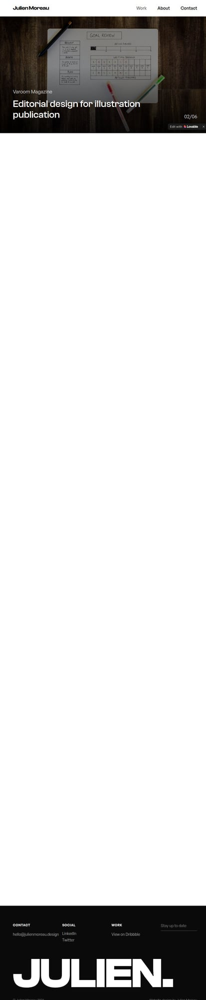

# Editorial Agency Portfolio — Website Template

## Overview
A professional agency portfolio template with editorial polish. It frames the work as sophisticated and premium, with case studies as the core storytelling unit.

## Layout
- **Header + CTA** with template title and description.
- **Hero preview frame** showing a typographic editorial block.
- **Key Highlights** list.
- **Features & Capabilities** accordion.
- **Long‑form narrative** about the template, audience, and steps.
- **Related templates + footer**.

## UX patterns
- Portfolio value proposition first, then detailed feature validation.
- Preview frame acts as credibility anchor.
- Step‑by‑step onboarding reduces friction for adoption.

## Animations
- Subtle hover states on CTA/buttons.
- Accordion micro‑motion for feature disclosure.

## Visual style
- Editorial, muted palette with strong typographic hierarchy.
- Large, framed preview and calm whitespace.
- Professional, understated presentation.

## Components
- Top navigation + CTA
- Preview frame
- Highlights list
- Accordion features
- Long‑form sections
- Related template cards

## Framework/stack (inferred)
- **Next.js + React**
- **Tailwind CSS**
- **shadcn/ui**

## Prompt cues to recreate
- “Create a premium agency portfolio template page with editorial typography and a framed hero preview.”
- “Use highlight cards, accordion features, and detailed onboarding sections.”
- “Keep the palette muted and professional.”
