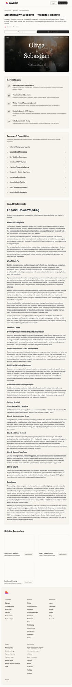

# Editorial Dawn Wedding — Website Template

## Overview
A magazine‑style wedding template with cinematic imagery and editorial typography. The layout conveys sophistication and a premium, story‑driven feel.

## Layout
- **Header + template title** with CTA and preview/create tabs.
- **Hero preview frame** showing a dark, photographic banner with dramatic serif text.
- **Key Highlights** section.
- **Features & Capabilities** accordion.
- **Extended narrative**: about, audience, use cases, steps.
- **Related templates + footer**.

## UX patterns
- The hero preview acts as the emotional hook.
- Long‑form content builds trust and positions the template as professional‑grade.
- Accordion keeps the feature list digestible.

## Animations
- Subtle hover states on CTAs.
- Smooth accordion expansion.

## Visual style
- Dark, cinematic hero imagery with soft glow.
- Serif headlines paired with clean sans body text.
- Premium editorial spacing and section breaks.

## Components
- Nav header + CTA
- Preview frame
- Highlights list
- Accordion features
- Long‑form sections
- Related template grid

## Framework/stack (inferred)
- **Next.js + React**
- **Tailwind CSS**
- **shadcn/ui**

## Prompt cues to recreate
- “Create a magazine‑style wedding template page with dark cinematic hero imagery and serif headlines.”
- “Use a framed preview, highlight list, and accordion features.”
- “Keep spacing editorial and premium.”
