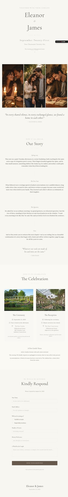

# Ivory Whispers Wedding — Website Template

## Overview
A soft, minimal wedding template centered on elegance and simplicity. The ivory palette, delicate typography, and restrained layout make it feel timeless and understated.

## Layout
- **Top nav + CTA** and template header.
- **Preview/Create tabs** above the hero frame.
- **Hero preview frame** with minimalist wedding card aesthetic.
- **Key Highlights** section.
- **Features & Capabilities** accordion.
- **Long narrative** sections and onboarding steps.
- **Related templates + footer**.

## UX patterns
- Minimal hero to communicate calm and clarity.
- Value props delivered in short highlight list, then deeper accordion details.
- Strong onboarding guidance in step list.

## Animations
- Minimal motion: hover/focus states and accordion transitions.

## Visual style
- Ivory and soft beige palette.
- Fine‑weight serif typography and lots of whitespace.
- Clean framing with subtle borders/shadows.

## Components
- Header nav + CTAs
- Preview frame
- Highlights card list
- Accordion feature list
- Long‑form article sections
- Related template cards

## Framework/stack (inferred)
- **Next.js + React**
- **Tailwind CSS**
- **shadcn/ui**

## Prompt cues to recreate
- “Design a minimalist wedding template page with ivory palette, delicate serif type, and lots of whitespace.”
- “Use a simple framed hero preview, highlight list, and accordion features.”
- “Keep interactions subtle and elegant.”
