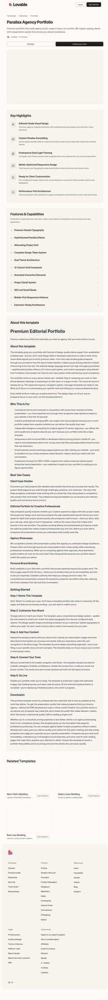

# Parallax Agency Portfolio — Website Template

## Overview
A premium agency portfolio template positioned around parallax/scroll‑driven storytelling. The content emphasizes visual depth and narrative flow.

## Layout
- **Header + CTA** with template name and preview/create tabs.
- **Hero preview frame** (light, minimal placeholder area).
- **Key Highlights** list emphasizing editorial layout and motion.
- **Features & Capabilities** accordion.
- **Long narrative** with use cases and onboarding steps.
- **Related templates + footer**.

## UX patterns
- Emphasis on “parallax” suggests scroll‑based storytelling as the key differentiator.
- Preview frame is the primary demonstration point.
- Accordion preserves scanning efficiency.

## Animations
- Likely parallax and scroll‑triggered transitions in the actual template.
- Page shell uses subtle hover/accordion motion.

## Visual style
- Minimal, premium palette with editorial typography.
- Large whitespace and clean alignment.

## Components
- Nav header + CTA
- Preview frame
- Highlights list
- Accordion features
- Long‑form sections
- Related template cards

## Framework/stack (inferred)
- **Next.js + React**
- **Tailwind CSS**
- **shadcn/ui**

## Prompt cues to recreate
- “Create an agency portfolio template page emphasizing parallax storytelling and editorial design.”
- “Keep layout minimal with a framed preview and clean typographic hierarchy.”
- “Include highlight list, accordion features, and onboarding steps.”
