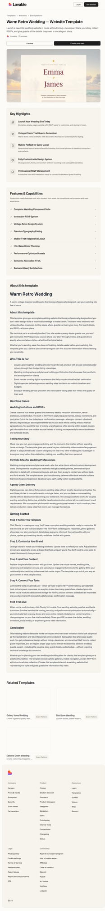

# Warm Retro Wedding — Website Template

## Overview
A warm, retro‑inspired wedding website template with soft textures, classic typography, and a gentle romance aesthetic. It positions the page as an all‑in‑one wedding hub: story, details, and RSVP.

## Layout
- **Global header** with Lovable navigation and CTA buttons.
- **Hero preview frame** centered below the page title, showing the wedding homepage.
- **Key Highlights** card list summarizing value props.
- **Features & Capabilities** accordion list for deeper detail.
- **Long‑form “About this template”** with sections, use cases, and setup steps.
- **Related templates** grid + site footer.

## UX patterns
- “Preview / Create your own” tab switcher encourages exploration vs. remix.
- Dense information hierarchy: quick highlights → expandable features → deep narrative.
- Reassurance copy (no‑code, fast launch) reduces adoption friction.

## Animations
- Subtle hover and focus states on buttons, cards, and accordion chevrons.
- Likely smooth accordion expand/collapse transitions.

## Visual style
- Warm neutrals, soft pastel accents, and serif hero typography.
- Spacious vertical rhythm and gentle contrast.
- Hero uses a framed, gallery‑like presentation to feel “printed invitation.”

## Components
- Top nav + auth buttons
- Hero preview frame (image/iframe)
- Highlight cards with icons
- Accordion feature list
- Sectioned long‑form article
- Related template cards

## Framework/stack (inferred)
- **React + Next.js** marketing page structure.
- **Tailwind CSS** utility styling.
- **Accordion / Card** components consistent with shadcn/ui.

## Prompt cues to recreate
- “Design a wedding template landing page with a framed hero preview, warm neutral palette, and serif headline.”
- “Add a highlight card list, accordion features, and long narrative sections with step‑by‑step onboarding.”
- “Keep spacing generous, soft shadows, and understated interactions.”
