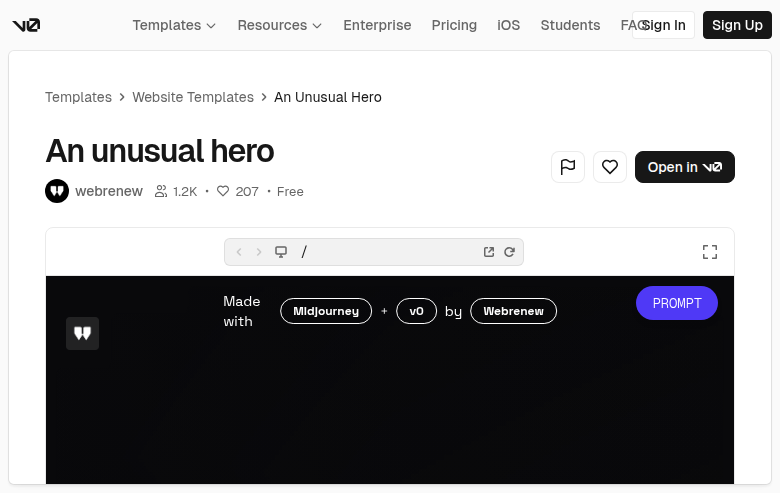

# An unusual hero (VZ9EEGUUq9M)

## Overview
The embedded preview surface is a dark, vignetted hero background that’s currently showing primarily an attribution/credit row rather than the full marketing headline block. The row reads “Made with Midjourney + v0 by Webrenew” and includes a prominent purple **PROMPT** pill button.

## Layout
- **Attribution row (top/center of hero)**
  - Left “Made with” label (stacked words).
  - Outlined pill chips: **Midjourney**, **v0**, **Webrenew**, separated by a small **+** and “by”.
  - Right-aligned filled pill button: **PROMPT** (purple/indigo gradient).
- **Left icon tile**
  - Small rounded square icon/badge near the left side of the hero canvas.

## UX patterns
- Attribution is treated as interactive UI (clickable-looking chips) rather than plain text.
- Single, high-emphasis CTA in preview: **PROMPT** (filled pill) contrasted against outlined chips.

## Visual style
- Dark, soft-vignette background (cinematic/spotlit center).
- High-contrast white typography.
- Rounded pill chips with thin white outlines.
- Accent-filled rounded pill button (purple/indigo) for emphasis.

## Components
- Hero canvas (dark background)
- Attribution row (label + outlined chips)
- Primary pill button (PROMPT)
- Small icon tile/badge

## Framework/stack (inferred)
- **Next.js + React**
- **Tailwind CSS**
- Likely **shadcn/ui** primitives (Button/Badge)

## Prompt cues to recreate
- “Design a dark, vignetted hero canvas that primarily showcases an attribution row rather than dense content.”
- “Add outlined pill chips for tools/author (Midjourney, v0, Webrenew) with small separators (‘+’, ‘by’) and a filled purple ‘PROMPT’ pill button on the right.”
- “Use high-contrast white type, thin outlines, and lots of negative space.”
