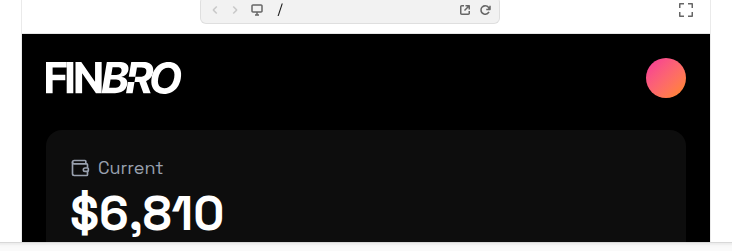

# FINBRO Dashboard (shuOX59VNOv)

## Overview
The embedded preview shows the top of a dark, high-contrast finance dashboard: a bold **FINBRO** wordmark on a near-black background, a circular warm gradient accent (top-right), and the beginning of a large KPI card with the headline metric **Current $6,810**.

## Layout
- **Header area**
  - Large, left-aligned **FINBRO** wordmark.
  - Top-right circular gradient accent (pink → orange), reading like an avatar or status indicator.
- **Primary KPI card (top of dashboard)**
  - Rounded, soft-elevated dark card.
  - Label row: small icon + “Current”.
  - Headline value: **$6,810** (very large type).

> Note: The embedded preview crop only exposes the header + start of the KPI card; deeper sections (charts/tables) aren’t visible in this preview capture.

## UX patterns
- Clear hierarchy: brand → primary KPI label → oversized metric value.
- Uses a single, recognizable gradient “status/avatar” element to add personality without adding clutter.

## Visual style
- Near-black canvas with subtle gradients.
- Rounded cards with soft shadows and inner glow.
- White primary type + muted gray secondary labels.
- Accent: warm pink/orange gradient (avatar/accent circle).

## Components
- Header with large wordmark
- Gradient accent circle (avatar/status)
- KPI card (label + headline metric)

## Framework/stack (inferred)
- **Next.js + React**
- **Tailwind CSS**
- Likely **shadcn/ui** (Button, Card, Table)
- Chart via a lightweight SVG/Canvas chart (or recharts) styled to match.

## Prompt cues to recreate
- “Create a dark fintech dashboard header with a bold wordmark on the left and a warm gradient circle on the top-right.”
- “Add a rounded, elevated KPI card that begins with a small icon + label (‘Current’) and a huge dollar amount.”
- “Use near-black background, soft shadows, muted labels, and high-contrast numerals.”
