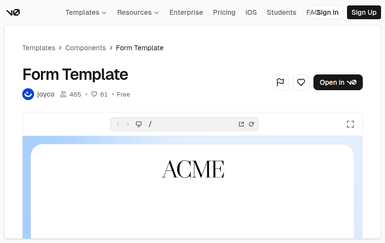

# Form Template (oZxBJ6zcOsz)

## Overview
The embedded preview shows the top portion of a branded form card: a large rounded white panel on a pale blue background with a centered serif wordmark **ACME**. The visible area is mostly the brand header and whitespace, suggesting an editorial, high-breathing-room form layout.

## Layout
- **Background**
  - Soft light-blue canvas.
- **Centered card**
  - Large rounded rectangle (white) with subtle border/shadow.
  - Centered brand header: **ACME** (thin, high-contrast serif).

> Note: In the embedded preview crop, the questionnaire text/buttons appear below the fold and are not visible in this capture.

## UX patterns
- Strong “brand-first” hierarchy: centered wordmark before any form fields.
- Intentional whitespace gives the form an editorial, premium feel.

## Visual style
- Clean, editorial feel (serif brand wordmark).
- Rounded card with subtle shadow on a pastel background.
- Minimal controls and plenty of whitespace.

## Components
- Page background (pastel)
- Card container (large, rounded)
- Brand header / wordmark (ACME)

## Framework/stack (inferred)
- **Next.js + React**
- **Tailwind CSS**
- Likely **shadcn/ui** (Card, Button, Typography)

## Prompt cues to recreate
- “Create a minimal form template on a soft blue background with a large centered white rounded card.”
- “Use an elegant, thin serif wordmark (‘ACME’) centered at the top with lots of breathing room.”
- “Keep typography editorial and spacing generous; form fields can start below the brand header.”
