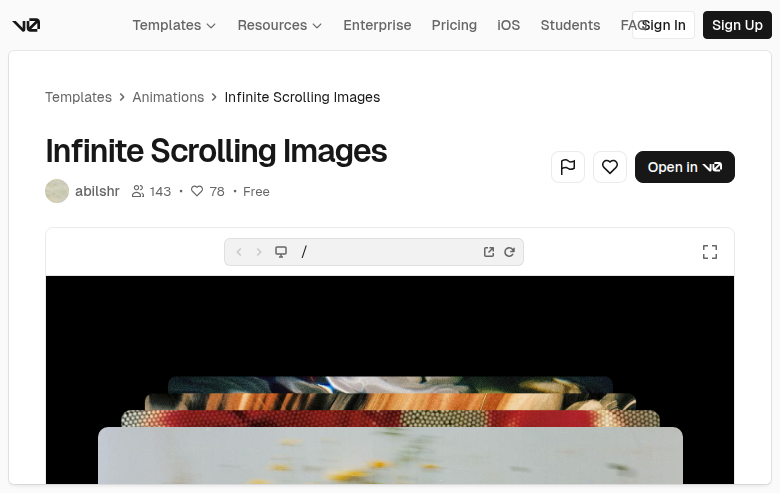

# Infinite Scrolling Images (mE2nwltmoDT)

## Overview
An animation pattern demo: an **infinite scrolling / looping** image carousel that reads like a continuous marquee of image cards. In the embedded preview, the visuals are presented on a black stage with a layered stack of rounded image cards (a “deck” look).

## Layout
- **v0 template detail wrapper**: header/nav + breadcrumbs + template metadata.
- **Embedded preview iframe**:
  - Full-bleed dark background.
  - A prominent, large rounded card in the foreground.
  - Multiple image cards stacked behind it, offset vertically to create depth.
  - Preview toolbar above the iframe (device, open/external, refresh, fullscreen).

## UX patterns
- Single-feature component showcase (the motion is the product).
- Likely includes hover affordances such as pause-on-hover and/or grab cursor.

## Motion / interaction
- Core motion: **seamless looping translation** of an image track (usually translateX) by duplicating content.
- Common enhancements (probable):
  - Gradient edge masks to fade cards in/out.
  - Pause on hover / focus.
  - Constant speed with linear easing.

## Visual style
- Dark, high-contrast stage.
- Large-radius cards with soft shadows.
- Overlapping “stacked” composition to imply abundance/continuity.

## Components (inside preview)
- Marquee/track container (overflow hidden)
- Duplicated image list for seamless loop
- ImageCard (rounded, shadow)
- Optional edge mask gradients

## Framework/stack (inferred)
- **Next.js/React** + **Tailwind CSS**.
- Surrounding template uses **shadcn/ui**; marquee itself is typically custom CSS/keyframes.

## Prompt cues to recreate
- “Create an infinite scrolling image marquee by duplicating the list and animating translateX continuously (linear).”
- “Render image cards with large rounded corners and subtle shadows on a pure black background; stack a few cards with offsets for a deck-like composition.”
- “Add gradient edge masks and pause-on-hover for usability.”
