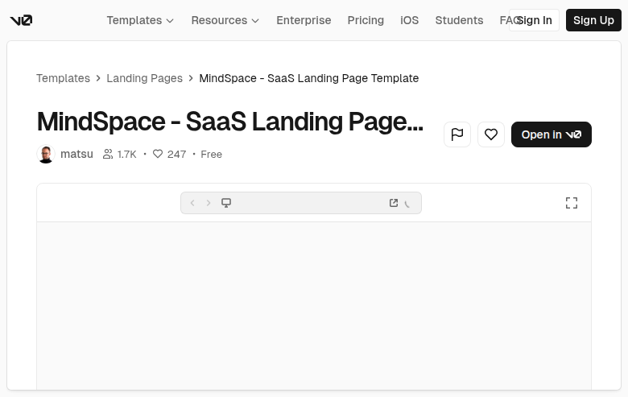

# MindSpace — SaaS Landing Page Template (8QhCJAwn16K)

## Overview
A community SaaS landing page template previewed within the v0 template detail shell. The page focuses on a clean, modern SaaS hero layout intended for product marketing.

## Layout
- **v0 global header** with navigation and auth actions.
- **Breadcrumbs**: Templates → Landing Pages → MindSpace.
- **Header block**: title, author/avatar, engagement counters, “Free” badge, primary CTA.
- **Embedded preview**: large framed viewport containing the landing page (hero likely below the fold in this capture).

## UX patterns
- Emphasis on “Open in v0” CTA to remix.
- Social proof (views/likes) near author.
- Embedded preview for quick evaluation.

## Animations
Minimal. Standard hover/focus states for buttons and preview controls.

## Visual style
- Minimal, spacious, product‑marketing aesthetic.
- Neutral palette with strong typographic hierarchy.
- Framed preview encourages focus on the landing page content.

## Components
- Top nav + auth buttons
- Breadcrumbs
- Template header metadata row
- Primary CTA button + icon actions
- Preview frame/iframe

## Framework/stack (inferred)
- **Next.js + React**
- **Tailwind CSS**
- **shadcn/ui** components (buttons, breadcrumbs, avatar, cards)

## Prompt cues to recreate
- “Design a v0 template detail page for a SaaS landing page: top nav, breadcrumbs, big title, author row with stats, and an ‘Open in v0’ CTA.”
- “Embed a large preview frame below the header for the landing page hero.”
- “Use a clean, modern SaaS aesthetic with ample whitespace.”
