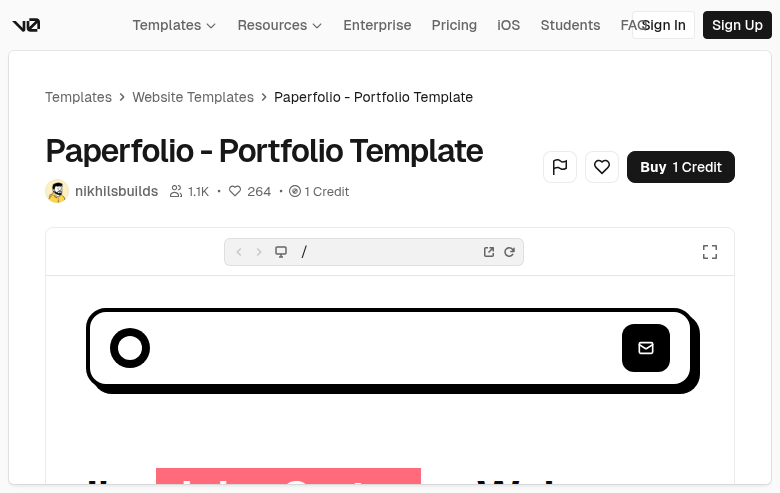

# Paperfolio — Portfolio Template (dDPFIVqPGXR)

## Overview
A portfolio website template with a bold, minimalist hero module and oversized rounded framing. The preview suggests a playful, high‑contrast layout for creative work.

## Layout
- **v0 shell** with breadcrumbs and template header.
- **Template header**: title, author, engagement metrics, pricing (“1 Credit”), primary CTA.
- **Embedded preview**:
  - Large rounded rectangle hero panel.
  - Minimal iconography (circle and mail icon).
  - Likely portfolio content below the fold.

## UX patterns
- Clear conversion CTA (“Buy 1 Credit”).
- Preview‑first evaluation through embedded frame.
- Minimalist hero to foreground the brand/identity.

## Animations
Likely minimal: hover states on CTA buttons and preview controls.

## Visual style
- High‑contrast black/white with thick rounded borders.
- Large, playful UI elements and simplified icons.
- Spacious, editorial layout.

## Components
- Top nav + auth
- Breadcrumbs
- Template header metadata row
- Primary CTA
- Preview frame/iframe
- (Inside preview) Hero card with icons

## Framework/stack (inferred)
- **Next.js + React**
- **Tailwind CSS**
- **shadcn/ui** components

## Prompt cues to recreate
- “Design a portfolio landing page with a bold rounded hero container and minimal iconography.”
- “Use strong black/white contrast, thick borders, and oversized rounded corners.”
- “Wrap it inside a template detail shell with breadcrumbs and a primary CTA.”
