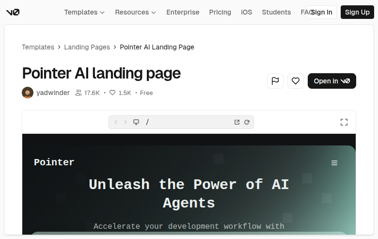

# Pointer AI landing page (XQxxv76lK5w)

## Overview
A community landing-page template for an AI product (“Pointer”) featuring a bold hero message and an embedded preview of the landing page inside the v0 template detail shell.

## Layout
- **Global v0 header** with navigation + auth actions.
- **Breadcrumbs**: Templates → Landing Pages → template name.
- **Header block**:
  - Large title
  - Author + engagement counters + “Free” label
  - Primary CTA (“Open in v0”) and secondary icon actions
- **Embedded preview**: shows the landing page hero section (brand name, headline, subcopy) within a framed viewport.

## UX patterns
- Primary CTA to open/duplicate.
- Social proof (views/likes) near author identity.
- Preview-first evaluation via embedded live frame.
- Familiar landing-page patterns inside the preview: brand in top-left, menu icon, large headline and supporting text.

## Animations
Minimal—hover/focus states on buttons/links; inside the preview, likely subtle transitions (e.g., nav/menu hover) but no heavy motion indicated.

## Visual style
- High-contrast hero inside the preview (dark/gradient background with large white headline).
- Modern, minimal product aesthetic.
- Generous whitespace and strong type scale.

## Components
- NavBar (global)
- Breadcrumb
- Avatar + metadata row (views/likes/free)
- Primary Button + IconButton set
- Preview frame/iframe with toolbar
- (Inside preview) Landing hero: brand text, headline, subhead, menu icon

## Framework/stack (inferred)
- **Next.js + React** page composition.
- **Tailwind CSS** utility styling.
- **shadcn/ui** components for buttons, breadcrumb, avatar, cards/dialogs.

## Prompt cues to recreate
- “Design a community template detail page for a landing page: top nav, breadcrumbs, big title, author row with views/likes/free badge, and a primary ‘Open in v0’ button.”
- “Embed a responsive preview frame below the header with a hero section: brand name left, hamburger menu right, giant centered headline, and supporting copy on a dark gradient background.”
- “Use modern typography, high contrast, and subtle hover states; keep layout clean and spacious.”
