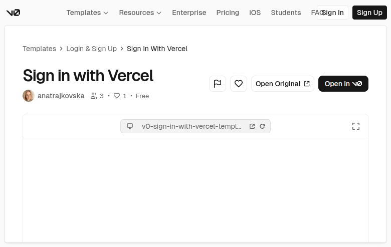

# Sign in with Vercel (E2PMKQo5S11)

## Overview
A login/sign-in template intended to replicate a “Sign in with Vercel” flow. The template page includes an additional CTA (“Open Original”) suggesting the preview may reference an external source. In the captured state the embedded preview area appears blank/unloaded.

## Layout
- **v0 shell**: global nav + breadcrumbs (Templates → Login & Sign Up → …).
- **Header block**:
  - Large title
  - Author + low engagement counters + “Free” label
  - Actions: like/share, “Open Original”, and “Open in v0”
- **Embedded preview**:
  - Large viewport container with toolbar
  - Content not rendered at capture time (blank frame)

## UX patterns
- Authentication pattern: single-purpose screen for sign-in.
- Template meta header with clear CTA to open/duplicate.
- “Open Original” supports source attribution / reference.

## Animations
Minimal—hover/focus states on buttons/links. (No in-preview motion visible due to blank render.)

## Visual style
- Neutral, documentation-like template shell.
- Expected inside-preview style: clean auth card, minimal fields, primary CTA.

## Components
- Breadcrumb
- Avatar + metadata row
- Button group (primary + secondary)
- Preview frame with toolbar
- (Expected inside preview)
  - Auth Card
  - Provider sign-in button (“Continue with Vercel”)
  - Optional email/password fields, divider, helper links

## Framework/stack (inferred)
- **Next.js + React**.
- **Tailwind CSS**.
- **shadcn/ui** primitives (Button, Card, Input, Separator, Label).

## Prompt cues to recreate
- “Create a sign-in page with a centered auth card, title ‘Sign in’, and a primary provider button ‘Continue with Vercel’ plus optional email/password fields.”
- “Include helper links (forgot password, sign up) and a subtle divider between provider and email sign-in.”
- “Use Next.js/React + Tailwind + shadcn/ui (Card, Button, Input, Label, Separator).”

